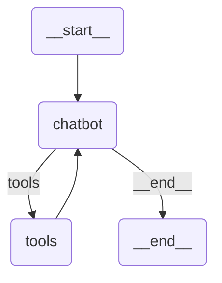

# AI Recruitment Assistant (LangGraph)

An advanced, stateful artificial intelligence agent designed to automate and enhance the IT recruitment process. Built with LangGraph, LangChain, and FAISS, this system processes natural language queries to parse job descriptions, search through PDF resumes, compare candidates, and generate customized interview questions.

## Core Features

* **Stateful Conversation:** Maintains context across multiple turns using LangGraph memory, allowing for iterative refinement of search criteria.
* **Retrieval-Augmented Generation (RAG):** Automatically parses, chunks, and embeds local PDF resumes into a FAISS vector database for fast semantic search.
* **Automated Requirement Extraction:** Processes raw job descriptions into structured requirements.
* **Deep Candidate Comparison:** Performs detailed head-to-head analysis of shortlisted candidates, highlighting specific strengths and capability gaps.
* **Explainable AI:** Provides clear reasoning for candidate rankings and search results based on the provided job parameters.
* **Interview Preparation:** Dynamically generates technical interview questions targeted at a specific candidate's potential weak points.

## System Architecture

The agent operates on a cyclic state machine architecture, allowing it to route between conversational reasoning and background tool execution seamlessly.



## Prerequisites

* Python 3.9 or higher
* An OpenRouter API Key
* A dataset of PDF resumes (e.g., from Kaggle)

## Installation & Setup

1.  **Clone the repository:**
```bash
    git clone <your-repository-url>
    cd <repository-directory>
    ```

2.  **Install dependencies:**
```bash
    pip install -r requirements.txt
    ```

3.  **Configure environment variables:**
    Create a `.env` file in the root directory and add your API credentials:
```env
    OPENROUTER_API_KEY=your_openrouter_api_key_here
    OPENROUTER_MODEL=openai/gpt-4o-mini
    ```

4.  **Load Candidate Data:**
    Create a folder named `data/resumes/` in the root directory and place your target PDF resumes inside. The system will automatically ingest, chunk, and embed these documents into the local vector database upon initialization.

## Usage

Run the agent via the command-line interface:

```bash
python matching_agent.py
```

**Example Interactions:**
* *Search:* "I am hiring a Senior IT Systems Administrator. Please find candidates with strong experience in Windows Server and at least 4 years of IT support."
* *Refine:* "Actually, make Azure cloud experience a must-have requirement as well. Please run the search again."
* *Compare:* "Use the comparison tool to evaluate candidate_1.pdf and candidate_2.pdf side-by-side."
* *Screen:* "Generate 3 targeted interview questions for candidate_1.pdf based on their skill gaps."

## Project Structure

* `matching_agent.py`: Core application entry point, CLI loop, and LangGraph state machine definition.
* `tools.py`: RAG initialization, FAISS database management, and external tool definitions.
* `requirements.txt`: Python package dependencies.
* `data/resumes/`: Local directory for PDF resume storage (create this directory if it does not exist).
* `.env`: Environment variable configuration (do not commit to version control).