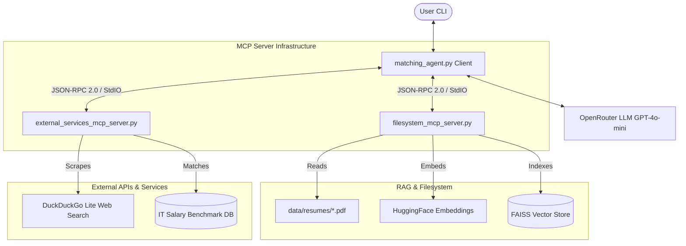

# AI Recruitment Assistant (MCP & LangGraph)

An advanced, stateful artificial intelligence agent designed to automate and enhance the IT recruitment process. The system is built on a decoupled **Model Context Protocol (MCP)** architecture, combining **LangGraph** state machine routing, **LangChain**, and **FAISS** RAG capabilities to screen and compare resumes.

The assistant connects to multiple MCP servers concurrently to handle local document extraction, semantic searches, live web searches, and salary benchmarking.

---

## System Architecture

The client application (`matching_agent.py`) acts as the MCP host. On startup, it launches and connects to two local MCP servers over standard input/output (StdIO) transport, dynamically aggregates their tools, and binds them to the OpenRouter LLM.



---

## Core Features

### Filesystem & RAG Services (Filesystem MCP Server)
*   **Vector Search & Ingestion**: Dynamically loads, chunks, and embeds local PDF resumes on startup using Hugging Face's `all-MiniLM-L6-v2` model and FAISS.
*   **Requirements Extraction**: Extracts structured `must_have` and `nice_to_have` skills from raw job descriptions.
*   **Deep Candidate Comparison**: Performs detailed head-to-head analysis of shortlisted candidates based on their resumes.
*   **Interview Preparation**: Identifies resume gaps and dynamically generates target screening questions.
*   **Directory Monitoring (`watch_directory`)**: Runs an async polling task that monitors for new PDF resume additions to auto-ingest and update the vector store index.
*   **Batch Ingestion (`batch_process`)**: Handlers multiple PDF files efficiently in a single transactional vector update.

### Live External Services (External Services MCP Server)
*   **Live Web Search**: Queries DuckDuckGo Lite dynamically for IT and networking market trends, with a built-in offline fail-safe fallback to handle rate-limiting.
*   **Salary Benchmarks**: Resolves salary ranges (Junior, Mid, Senior) and recommended certifications for IT and networking roles.

### Stateful Reasoning (LangGraph Client)
*   **Stateful Memory**: Maintains conversational context across turns using a LangGraph `MemorySaver` checkpointer.
*   **Dynamic Binding**: Automatically discovers tools from connected MCP servers and binds them, decoupling tool logic from the agent execution layer.

---

## Prerequisites

*   Python 3.9 or higher
*   An OpenRouter API Key
*   A folder containing PDF resumes inside `data/resumes/`

---

## Installation & Setup

1. **Clone the repository and enter the directory**:
   ```bash
   git clone <your-repository-url>
   cd <repository-directory>
   ```

2. **Install dependencies**:
   ```bash
   pip install -r requirements.txt
   pip install mcp mcp[cli] duckduckgo-search beautifulsoup4
   ```

3. **Configure environment variables**:
   Create a `.env` file in the root directory and add your API credentials:
   ```env
   OPENROUTER_API_KEY=your_openrouter_api_key_here
   OPENROUTER_MODEL=openai/gpt-4o-mini
   ```

4. **Verify Candidate Data**:
   Ensure your PDF resumes are placed inside `data/resumes/`. The filesystem server will automatically index them on boot.

---

## Usage

### 1. Run the Integration & Verification Suite
Validate the entire Multi-MCP client-server architecture, tool discovery, resource querying, and fallback search flows:
```bash
python test_mcp_flow.py
```

### 2. Run the Interactive Recruiter Assistant CLI
Run the main agent application to start an interactive terminal session:
```bash
python matching_agent.py
```

#### Example Interactions:
*   *Search*: `"Find candidate resumes matching CCNA/Active Directory and Group Policy."`
*   *Salary Check*: `"What is the standard salary range for a mid-level Systems Administrator?"`
*   *Live Search*: `"What are the latest CCNP certification trends in 2026?"`
*   *Compare*: `"Compare 10089434.pdf and 10247517.pdf side-by-side."`
*   *Screen*: `"Generate interview questions for 10089434.pdf based on their gaps."`

---
